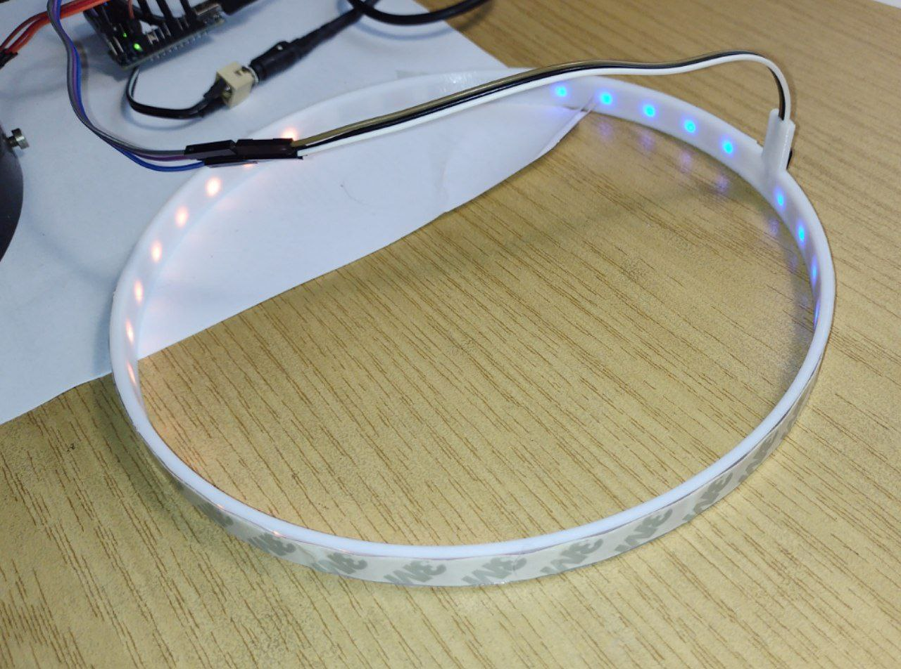

# SerServo
A serial line text protocol for a servo, using an arduino nano

This is used to drive the pointer on a 20cm diameter prehistoric ampere-meter.
It also features a ws2812 led-strip (also controlled through the serial protocol), and some 3d printed parts to implement this particular usecase of SerServo. Yes, the ampere-meter is now remote controlled ( - aka it is a fake).

## Wiring

I am using a bunch of dupont jumper cables, each with a male and female connector.
e.g. 3 male ends fit nicely into the standard servo connector, and the three losse ends with their female sockets, can be easily paced on the different positions on the arduino board.
Therefore I populated (ca. half of) the pin holes with pinheaders. The servo is usually color coded brown, red, orange.
Brown connects to a GND pin, red to +5V, and orange to D9.

The WS2812 LED strip comes with a round plug for power and a 3pin male connector.
The round plug is great for an external 5V 3A power supply, which is optional, since when keeping an eye of power consumption, the USB connector is sufficient. But when pushing LED brightness to its limits, and frantically driving the servo back and forth, a total of 3A migt be needed to avoid spurious resets.

Connect GND and +5V of the strip to the arduino board (even if you plan to use an external power supply)
There are two pins marked with GND, sufficient or both servo and strip. But only one pin is marked with +5V. A second (unlabeled) +5V pin can be found on the 6-pin (2x3) programming connector.
The data pin of the WS2812 connects via a 330 Ohm resistor to arduino pin D6.

## Mechanics

In my case, a piece of 35 LEDs nicely fits around inside circumference. You can glue the strip with its adhesive side directly to the cover. It may or may not stick well enough. Especially during assembly, when the cables move, it might come off.
I designed a 3D-printed mounting ring for this. LEDs sit on the outside of the ring, facing inwards, so make sure to use some material that shines through nicely. I used white PETG, which seems good enough, although transparent should work better.
The adhesive side of the strip is then only used to wrap some other tape around the strip, so that it is held in place on the ring.

## USB-serial

The baud rate is 115200, no parity, two stop bits.

### Power supply
To simplify the circuit, we try to use the USB line also as a 5V power source.
According to https://www.arduino.cc/en/uploads/Main/ArduinoNano30Schematic.pdf, USB is coupled to the onboard +5V pins with a 0.5A Schottky diode MBR0520, so the total current draw should not exceed this value. The Schottky diode is actually there to allow us to connect both USB power and if needed an external
5V power supply without any problems.

The micro-servo can draw up to 1A, when under load or when moving at high speed.
The LED-strip can use max 60mA per LED, when all 3 channels R,G,B are at full brightness. This is a total of 2.1A + 1A ... -- which would not work via USB power.

#### Precautions
- The arduino nano schematics has a 100 nF and 4.7 uF capacitor on the USB side.
- We provide an external 5600 uF capacitor to buffer motor spikes.
- There is a default B brightness setting, that dims all values to below 50%.
- The default illumniation powers only the bottom half of the ring, at a dim orange.
- We use a custom servo driver that only sends a few pulses when moving, then stops the PWM, so that the motor gets powered down.
- We remember the previous PWM position and move the motor slowly towards the next set position to save power.

#### Power up and power down

The standard arduino setup() function is used to initialize the serial line, servo and led strip.
The servo is moved to position 0, the bottom half of the led strip starts glowing.

At power down, we "plan to" return the servo to position 0 before power really runs out.
To do so, we use the energy stored in the big 5600 uF capacitor together with a hardware modification on the arduino nano board:
- Connect pin D12 with the positive end of the 4.7uF onboard capacitor. This can be done with a short piece of wire soldered onto the pads, which are only 2mm apart.
- Bridge the capacitor with a 1k discharge resistor.

At powerloss, the schottky diode immediately disconnects USB power and the +5V rails. At pin D12 we detect the USB power loss (due to the discarge resistor), while the +5V rails still provide power. This allows us, to send one last motor moveto(0) command (at full speed!) and hope for the best.

This mimics what an original analog hardware meter would do. It might also help us to savw power at the next startup, as the servo is already at the desired position.

## Commands
Commmands start with a letter, can contain any amount of whitespace (ignored).
Then (optionally) decimal numbers follow, separated by whitespace, the command ends in a newline and or carriage retun
An empty command is ignored.

<pre>
P [x]
	x defaults to 0. Moves the servo to a position 0...1000
O
	Report servo calibration offsets.
O min max
	Set servo calibration offsets. For identity use: O 0 100.

B
	Report LED brightness setting.
B nn
	Set LED brightness in percent for subsequent C commands, default 50.
C
	Set all LEDs to 255, 255, 255
C x
	Sets all LEDs to color r=x, g=x, b=x	(0..255)
C r g b
	Sets the RGB value of all LEDs
C r g b n
	Set only LED n to the r g b value. n in 0..34)
	All other LEDs remain as they are.
C r g b n m
	Set LEDs n to m (inclusive)

H
?
	Print the above command summary.
</pre>
